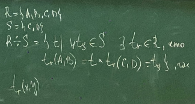

# Базы данных. Лекция 3

#### Реляционная модель
* Структурная
* Целостная
* Манипуляционная (реляционная алгебра)

### Реляционная алгебра
* Операции над множествами
  * Объединение (union)
  * Пересечение (intersect)
  * Вычитание (minus)
  * Декартово произведение (times)
* Специальные оператооы реляционной алгебры
  * Фильтрация (where)
  * Проекция (select)
  * Соединение (join)
  * Деление (divide by)
  
### Синтаксис реляционной алгебры
* **реляционное_выражение** ::= унарное_выражение | бинарное_выражение
* **унарное_выражение** ::= проекция | фильтрация | переименование
* **переименование** ::= терм RENAME имя_атрибута AS новое_имя
* **терм** ::= имя_отношения | (реляционное_выражение)
* **фильтрация** ::= терм WHERE логическое условие
* **проекция** ::= терм | терм [<список атрибутов>]
* **бинарное_выражение** ::= проекция бинарная_операция реляционное_выражение
* **бинарная_операция** ::= объединение | пересечение | вычетание | дек. пр. | соединение | деление

|id|Имя|Возраст|Цвет|Рост|Размер|
|---|---|---|---|---|---|
|1|Анастасия|18|рыжий|170|S|
|2|Рапунцель|18|блонд|164|XS|
|3|Ариель|16|красный|200|S|
|4|Фиона|20|корич|210|XL|
|5|Аид|10000|огненый|230|XXL|

|id|Имя|Принцесса|
|---|---|---|
|1|Геркулес|5|
|2|Шрек|4|
|3|Эрик|3|
|4|Распутин|1|
|5|Дмитрий|1|
|1|Геркулес|2|
> В последней строке - аномалия вставки

---
Примеры
1) `Принцесса[id, имя] union Принц[id, имя]`
   * Если будет `Принцесса[id, имя] union Принц[number, имя]`, то надо переименовать: `Принцесса[id, имя] union (Принц[id, имя] RENAME number AS id)`
2) `Принцесса[id, имя] minus\intersect Принц[id, имя]`
3) `Принцесса TIMES Принц`
4) `Принцесса WHERE рост > 200 AND рост < 250`
5) `Принцесса JOIN (((Принц RENAME id AS number) RENAME имя AS имя_принца) RENAME Принцесса AS id)`
6) 
    ```
    R = {A, B, C, D} 
    S = {C, D}
    ```
    

---
Пример:  
 Таблица поставщиков: S (S_number:integer; S_name:string)

1) Получить названия поставщиков, которые поставляют детали под номером 2
    ```
    ((S join SP) where P_number = 2)[S_name]
    S_number
    ```
2) Получить названия поставщиков, которые поставляют детали красного цвета
    ```
    (((S join SP) join P) where Color = "Красный")[S_name]
    (Можно и наоборот P->SP->S)
    ```
3) Получить пары поставщиков, которые находятся в одном городе
    ```
    ((S rename S_number as firstS_number)[firstS_number, City]) join 
    ((S rename S_number as secondS_number)[secondS_number, City]) where
    firstS_number > secondS_number)[firstS_number, secondS_number]
    ```


